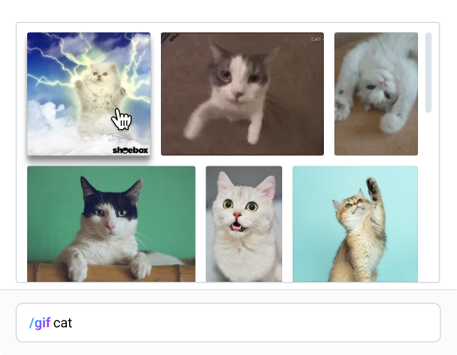

# ВКонтакте на практике

## Тестовое задание на стажировку по фронтенду в команду «Веб-мессенджер»

Нужно разработать интерфейс поиска и выбора gif изображений, встроенный в поле ввода.

- Интерфейс поиска должен активироваться, когда вводимый текст начинается с комбинации /gif.
- Текст после ключевой комбинации и пробела используется в качестве запроса для поиска подходящих gif изображений.
- В качестве источника изображений можно использовать любой сервис с соответсвующим API. Например, [giphy](https://developers.giphy.com/).
- После выбора изображение отображается над полем ввода как отправленное.

## Пожелания

- Постарайтесь сделать максимально удобный для пользователя интерфейс.
- Подумайте про управление с клавиатуры и доступность.
- Помните про скорость загрузки и производительность.

## Если оказалось слишком просто

Можно поработать над улучшениями:
- сложной masonry сеткой для вывода gif в поиске
- оптимизацией поисковых запросов
- виртуализацией списка
- анимацией "отправки"
- любым собственным :)

## Результат

В результате мы ожидаем увидеть html-страницу или веб-приложение со всеми необходимыми ресурсами.

- Вы можете использовать фреймворк для UI, если хотите.
- Вы можете использовать сторонние зависимости, если считаете это необходимым, но помните, что мы хотим увидеть именно ваш скилл.
- Результат, оформленный в виде репозитория (например, Github), будет плюсом.
- Результат, выложенный на любой удобный хостинг (например, Heroku), будет плюсом.

## Ресурсы

- [Дизайн в Figma](https://www.figma.com/file/tiqe4OR4MQXNZKeB9GmxL3/GIF-picker?node-id=0%3A1)
